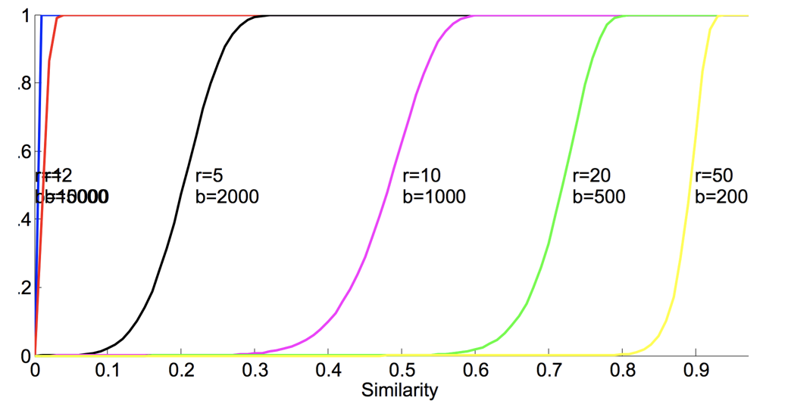

# DataMining-LearningFromLargeDataSet-Task1
ETH Zurich Fall 2017

WUU, Cheng-Hsin | wch@student.ethz.ch
October 17, 2017

Approximate Nearest Neighbor with Locality Sensitive Hashing

1.	Task Description 
In this project, we are going to develop the MapReduce function based on Locality Sensitive Hashing for detecting near-duplicate html pages. This function will give the user of web search the elegant search results by not displaying those web pages storing duplicates or near duplicate information. 

2.	Implementation 
Based on LSH, we are going to build a hash function that can map similar items to the same bucket. Theoretically, this simple hash function will be constructed in the following way: 

(1)	Input the data of documents you want to compare in 1/0 matrix format 
(2)	Use random permutation π to reorder the rows of the 1/0 matrix, and this random permutation π will be used for all columns C in the 1/0 matrix 
(3)	h(C) = minimum row number in which permuted column contains as 1, which can be represented as h(C)=h_π (C)=min┬(i:C(i)=1)⁡〖π(i)〗 
This approach is called Min-hashing. After processing all the columns C (each column represents a set of data for one page) in the matrix, we will get the Signature Matrix M. However, this approach required lots of processing time and space. Therefore, in the practical aspect we will use the algorithm that reduce the time and space complexity. 

To start, we need to transfer the original data to the 1/0 matrix, and how we do it is we will create a 8193x1 matrix for each page. For each row of the page matrix, if the index of the row has the corresponding data feature, then we will mark this cell as 1, otherwise it will be 0. For example, page1 contains data features 2310, 1916, 3585, then we will mark the row with index 2310, 1916, 3585 as 1 and other rows in the matrix will be marked as 0. Next, instead of representing random permutation π with huge size, we will just directly represent permutation π by hash function . Therefore we can get π(i)=h(i)=(a*i+b mod p)  mod N, where p is a large prime number, N is the number of total rows, a ~ Unif({1,…,N}), and b ~ Unif({0,…,N}). One thing needs to be aware here is that it is possible that, but this is actually rare for a good By this way, we can store efficiently and also can process the matrix in the row-wise way. Before comparing the data in the Signature Matrix M and get Jaccard Similarity for every 2 pages, we will use multiple hash tables to reduce the false negative rate, which will allow us to get the more accurate result. This process called partition, and will be implemented in the following way:

(1)	Signature Matrix M partitioned into b bands of r rows 
(2)	One hash table per band, which is the independent hash functions 
(3)	For each band, hash its portion of each column to its hash table (for simplicity, we don’t consider false collisions) 
(4)	Candidate pairs are columns that hash to the same bucket for at least one band 
	
Eventually, we will just check if the Jaccard Similarity of each candidate pairs exceed 85%. If yes, then we will detect it as duplication. 

In conclusion, what will be the input and output for the mapper and reducer function in the form of (key, value) would be:

3.	Analysis  
The working principle behind Min-hashing and Partition will be explained here. 
(1)	Min-hashing 
Consider that we have two pages and we want to check tis Jaccard Similarity. Two pages have the following input 1/0 matrix:
We firstly start from Jaccard Similarity, and we know that there are only fours kind of row type, which is [1,1], [1,0], [0,1] and [0,0]. Label their number of occurrence as a, b, c, and d respectively. Then we can get Sim(page1,page2)=a/(a+b+c)=|page1∩page2|/|page1∪page2| Consider stepping through the 1/0 matrix through in the order of random permutation π. We stop when encounter a “1” in either column. Since “page1 and page2 are hashed into same bucket” is equal to “type of row is [1,1]”, we can get that P(page 1 amd page 2 are in the same bucket)=a/(a+b+c) Eventually, we will get P_π (h_π (page1)=h_π (page12))= Sim(page1,page2)
(2)	Partition 
Signature Matrix M partitioned into b bands of r rows. Suppose columns C1 and C2 have similarity . Each column Ci is partitioned into [Bi,1,…,Bi,b] where Bi,j is of length r. For one band α, 

This formula will have graph in S curve shape, which means that if we have multiple hash funcs, we can boost the gap between similar and non-similar pairs. The example is shown below:

This is the key insight why we can reduce the false negative and false positive
4.	Result 

Based on the reference:

We choose r=20 and b=500 as we prefer few false negatives and more false positives. If we miss false negative, it means that we lost data. While having more false positives only cause more work. Also, for the big prime number we choose 105667, and eventually we get the public score 1.0 within running time 34 secs.

